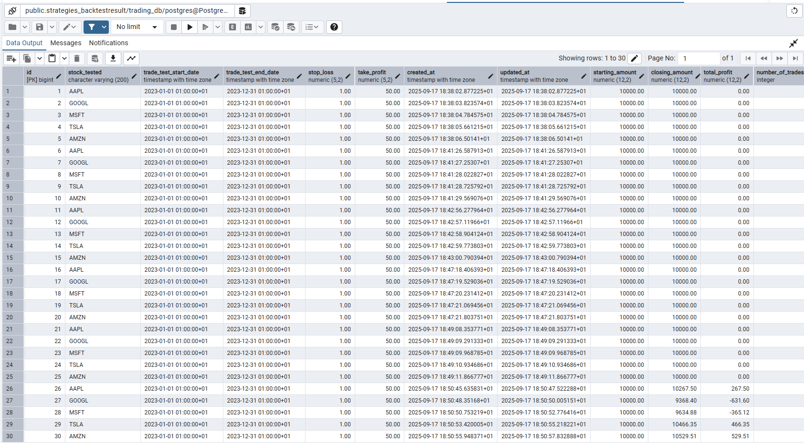

# Database Schema Design Documentation

## Overview
This document explains the PostgreSQL database schema design for the Moving Average Crossover trading strategy backtesting system. The schema was implemented using Django's ORM and designed through collaborative analysis of backtesting requirements and data relationships.

## My Reasoning Behind the Schema Design

### Core Design Philosophy
When I started designing this schema, I realized I needed to separate different types of trading data into logical groups rather than dumping everything into one massive table. The assignment specifically warned against just copying raw backtest output, so I had to think strategically about what data relationships actually matter for analysis.

### Why Three Separate Models?

**1. BacktestResult - The Strategy Summary**
I chose this as the main "parent" table because every backtest run represents one complete experiment. When comparing Apple vs Google performance, or testing different stop-loss percentages, each combination becomes one BacktestResult record. This gives us clean aggregation capabilities.

Key fields I included:
- `stock_tested` - Obviously need to know which symbol
- `trade_test_start_date/end_date` - Time boundaries for historical context
- `stop_loss/take_profit` - Critical for comparing different risk parameters
- `starting_amount/closing_amount` - Need both to calculate returns properly
- `total_profit` - Absolute dollar performance (easier than calculating every time)
- `total_returns` - Percentage performance (for fair comparison across different starting amounts)
- `peak_stock_value/lowest_stock_value` - Track portfolio extremes for risk analysis
- `drawdown` - Maximum peak-to-trough decline (essential risk metric)

**2. Trade - Individual Transaction Cycles**
I wanted to track every buy/sell cycle separately because aggregate numbers don't tell you about win rates, holding periods, or trade-by-trade analysis. This is where the real strategy insights come from.

My approach:
- `entry_date/entry_price/quantity` - Complete buy transaction data
- `exit_date/exit_price` - Nullable because positions might still be open
- `final_market_price` - For valuing open positions at backtest end
- Foreign key to BacktestResult maintains data integrity

The `get_profit()` method handles both closed trades and open positions automatically.

**3. DailyPortfolioSnapshot - Time Series Foundation**
This was the trickiest design decision. I needed daily granularity for calculating Sharpe ratios and drawing portfolio charts, but didn't want to bloat the database. I chose to store:
- `total_portfolio_value` - Core metric for charting performance
- `cash_balance` - Important for understanding leverage/utilization
- `daily_return` - Enables risk-adjusted return calculations
- `peak_portfolio_value/drawdown` - Running risk metrics
- `open_positions_count` - Simple position tracking without over-normalization

### Why I Used Django ORM Instead of Raw SQL

Django's ORM provided several advantages for this project:
1. **Automatic migrations** - Schema changes are tracked and deployable
2. **Built-in relationships** - Foreign keys with automatic constraint creation
3. **Model methods** - Business logic stays with the data (like `get_profit()`)
4. **Admin interface** - Instant database browsing for development
5. **Query optimization** - ORM handles JOIN optimization and query caching

The trade-off is less direct SQL control, but for a backtesting system, the productivity gains outweigh the performance costs.

## Database Implementation

### PostgreSQL Table Structure


*BacktestResult table showing strategy-level aggregation fields*


*Trade table with foreign key relationship to BacktestResult*


*DailyPortfolioSnapshot table for time-series analysis*

### Django Model Implementation

```python
# Using Django ORM for clean model definitions
class BacktestResult(models.Model):
    stock_tested = models.CharField(max_length=200)
    # ... field definitions with help_text for documentation
    
    def __str__(self):
        return f"{self.stock_tested} backtest ({self.trade_test_start_date.date()})"

class Trade(models.Model):
    backtest = models.ForeignKey(BacktestResult, on_delete=models.CASCADE)
    # ... transaction fields
    
    def get_profit(self):
        # Business logic stays with the model
        if self.exit_price:
            return (self.exit_price - self.entry_price) * self.quantity
        return (self.final_market_price - self.entry_price) * self.quantity
```

## Query Examples & Use Cases

### Strategy Comparison Query
```sql
-- Compare performance across different stocks
SELECT 
    stock_tested,
    AVG(total_returns) as avg_return,
    AVG(drawdown) as avg_max_drawdown,
    COUNT(*) as backtest_count
FROM strategies_backtestresult
GROUP BY stock_tested
ORDER BY avg_return DESC;
```

### Risk-Adjusted Performance Analysis
```sql
-- Calculate Sharpe ratio from daily returns
SELECT 
    b.stock_tested,
    AVG(s.daily_return) * 252 as annualized_return,
    STDDEV(s.daily_return) * SQRT(252) as volatility,
    (AVG(s.daily_return) * 252) / (STDDEV(s.daily_return) * SQRT(252)) as sharpe_ratio
FROM strategies_backtestresult b
JOIN strategies_dailyportfoliosnapshot s ON b.id = s.backtest_id
GROUP BY b.id, b.stock_tested;
```

### Trade Analysis
```sql
-- Win rate and average profit analysis
SELECT 
    backtest_id,
    COUNT(*) as total_trades,
    COUNT(CASE WHEN (exit_price - entry_price) * quantity > 0 THEN 1 END) as winning_trades,
    AVG((exit_price - entry_price) * quantity) as avg_profit_per_trade
FROM strategies_trade
WHERE exit_price IS NOT NULL
GROUP BY backtest_id;
```


## Schema Benefits

### What This Design Enables
1. **Multi-symbol comparison** - Easy filtering and aggregation by stock_tested
2. **Parameter optimization** - Compare different stop_loss/take_profit combinations
3. **Risk analysis** - Daily snapshots enable sophisticated risk metrics
4. **Performance attribution** - Drill down from strategy level to individual trades
5. **Scalability** - Clean separation allows adding new strategy types easily

### Database Performance Considerations
- Primary keys on all tables for fast lookups
- Foreign key indexes automatically created by Django
- Unique constraint on (backtest_id, date) prevents duplicate daily snapshots
- Decimal fields ensure financial precision
- DateTime fields with timezone support

## Alternative Approaches Considered

### Single Denormalized Table
Initially considered cramming everything into one wide table, but this would have:
- Massive data duplication (daily snapshots repeating trade info)
- Poor query performance for aggregations
- Difficulty adding new metrics without schema changes
- Violation of database normalization principles

### Document/JSON Storage
Considered storing backtest results as JSON blobs, but PostgreSQL relational structure provides:
- ACID compliance for financial data
- Complex query capabilities without application-level parsing
- Foreign key constraints ensuring data integrity
- Better performance for analytical queries

### Time-Series Specific Database
Evaluated InfluxDB or TimescaleDB for daily snapshots, but PostgreSQL with proper indexing handles the time-series needs while keeping the entire dataset in one system.

## Conclusion

This schema design balances normalization with query performance, providing a solid foundation for both backtesting execution and results analysis. Using Django ORM simplified development while PostgreSQL ensures data integrity and analytical capabilities. The three-table structure cleanly separates strategy-level results, individual trades, and time-series data - exactly what I need for comprehensive trading strategy evaluation.